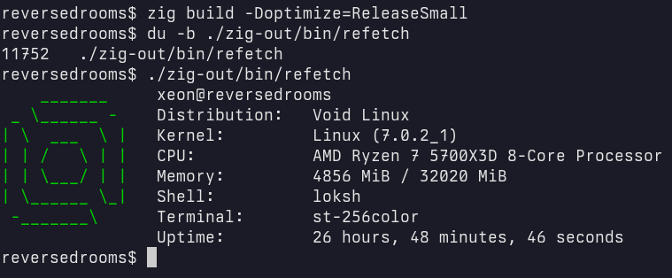

# refetch
a no-nonsense, simple and minimal system information fetching tool for Linux-based systems.


## What
`refetch` is ~400 lines of idiomatic Zig that is:
- simple, portable, coherent
- tiny: the binary is smaller than most tools, including microfetch's Cargo.lock
- fast, I guess

## Why?
The state of fetch tools is an embarrassment.
- **Fastfetch** is a bloated, enterprise-grade monument to C++ism.
- **Microfetch** is a case study in **Engineering Misalignment**. It's 5000 lines of deranged, unidiomatic Rust.
- **0fetch** is an assembly mess; claiming x86_64 is the only "actual architecture" is a pure delusion - it's the Windows of ISAs. Writing unportable code doesn't make you elite, it just makes your tool useless.

#### Nerd Fonts are wasting your time and mine.
Why the fuck are you loading 20MB of "Nerd Fonts" just to render a folder icon and some system uptime? Are you even going to notice that it's not some special glyph? Why do you even bother when it just turns your terminal into a cluttered mess of low-res icons? Stop fucking around with font-patching scripts and use the charset your terminal already has.

## Performance
Measured with `hyperfine`.
| Command | Mean [µs] | Min [µs] | Max [µs] | Relative |
|:---|---:|---:|---:|---:|
| `refetch` | 169.9 ± 45.2 | 36.9 | 265.0 | 1.17 ± 0.47 |
| `fastfetch` | 6846.4 ± 220.1 | 6286.6 | 7483.6 | 47.01 ± 14.38 |
| `microfetch` | 403.0 ± 43.4 | 238.1 | 504.7 | 2.77 ± 0.89 |
| `0fetch` | 145.6 ± 44.3 | 25.2 | 247.8 | 1.00 |

## Installation
The only requirement is a `zig` compiler.
- NOTE: in case you don't happen to have one, you can use the `envrc` shell script included in this repository. No need for an esoteric functional language to obtain a single binary.

```
zig build -Doptimize=ReleaseSmall
```

This is it. The configuration of `refetch` is done by editing the `refetch/config.zon` file and (re)compiling its source code.

